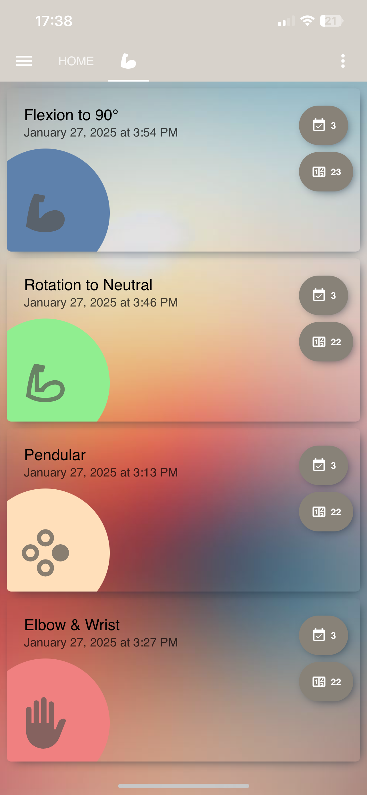

# Home Assistant Dashboard

How to create a excercise tracker Dashboard.  I used this to help with Shoulder Surgery.

## Overview





## Guide

### 1. Setting Up the Dashboard

1. Create a new sections dashboard
2. Add the Designer.png as the dashboard background
3. Add the Theme https://github.com/aFFekopp/noctis to Home Assistant


<p align="center">
    
    <br>
    <em>Designer.png</em>
</p>

## Helpers

Helpers are used to create custom inputs and outputs for your dashboard.

### Creating Helpers

1. Go to "Configuration" > "Helpers".
2. Click on "Add Helper".
3. Create the following Helpers as Counters: (add more as neccesary)
    | Helper Name | Type         |Description |
    |-------------|--------------|------------|
    | arm_1_day   | Counter      | Daily counter for arm exercises |
    | arm_1_total | Counter      | Total counter for arm exercises |
    | arm_2_day   | Counter      | Daily counter for arm exercises |
    | arm_2_total | Counter      | Total counter for arm exercises |
    | arm_3_day   | Counter      | Daily counter for arm exercises |
    | arm_3_total | Counter      | Total counter for arm exercises |
    | arm_4_day   | Counter      | Daily counter for arm exercises |
    | arm_4_total | Counter      | Total counter for arm exercises |
    | arm_button1 | input_button | Input Button for arm exercises  |
    | arm_button2 | input_button | Input Button for arm exercises  |
    | arm_button3 | input_button | Input Button for arm exercises  |  
    | arm_button4 | input_button | Input Button for arm exercises  |  


## Automations

### Increment total and daily when the button is pressed
(repeat for each button)
```yaml
alias: Count Arm Button 1
description: ""
trigger:
    - platform: state
        entity_id: input_button.arm_button1
condition: []
action:
    - service: counter.increment
        target:
            entity_id:
                - counter.arm_1_day
                - counter.arm_1_total
mode: single
```
### Reset Daily Counter at midnight
```yaml
alias: Reset Daily counters for Arm button
description: ""
triggers:
  - trigger: time
    at: "00:00:00"
conditions: []
actions:
  - action: counter.reset
    target:
      entity_id:
        - counter.arm_1_day
        - counter.arm_2_day
        - counter.arm_3_day
        - counter.arm_4_day
    data: {}
mode: single
```

### Notify me if I haven't done 3 sets by 18:00
```yaml
alias: Notify if not enough exercises completed
description: ""
triggers:
  - trigger: time
    at: "18:00:00"
conditions:
  - condition: numeric_state
    entity_id: counter.arm_1_day
    below: 3
  - condition: or
    conditions:
      - condition: numeric_state
        entity_id: counter.arm_2_day
        below: 3
  - condition: or
    conditions:
      - condition: numeric_state
        entity_id: counter.arm_3_day
        below: 3
  - condition: or
    conditions:
      - condition: numeric_state
        entity_id: counter.arm_4_day
        below: 3
actions:
  - data:
      message: Do more Exercises
    action: notify.mobile_app_jtb
mode: single
```


